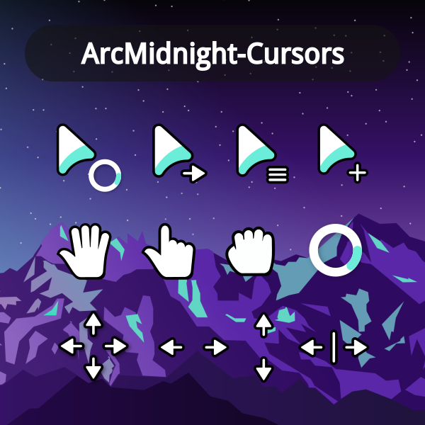
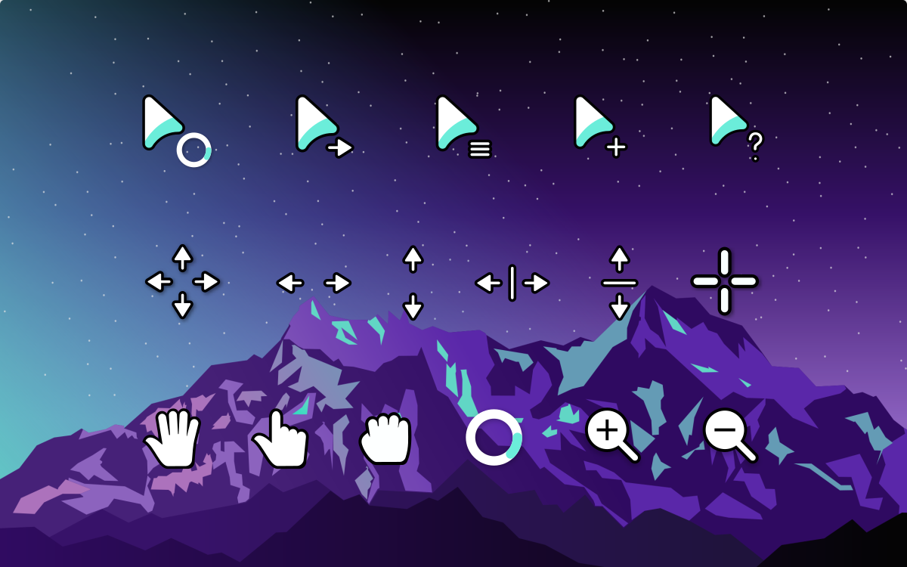

# Viridian Modification

This fork of ArcMidnight cursors exists because I wanted Viridian colored cursors that were scalable in size. It is one of my favorite colors, and these cursors are some of my favorite cursors. I achieved this simply by using sed to replace the color codes in the svg files, and then building the cursors from the included build.sh script. The exact sed command was sed -i -e "s/#6bedda/#007f66/" *.svg 

Additionally I am uploading the cursors in a .tar.gz file which can be copied to your personally preferred location for cursors, or whatever your distribution dictates. For most, putting in ~/.icons or ~/.local/share/icons is enough for a user install. For a system install, put them in /usr/share/icons. Additionally, you may want to modify your default cursor theme on the system to inherit this cursor theme to avoid the cursor switching between windows. To do this, edit /usr/share/icons/default/index.theme as root and where it says Inherits= you want to modify it to read Inherits=ArcMidnight-Viridian.

I claim no rights to the cursors or anything like that, I just wanted to share my minor contributions. The original readme follows below:

# ArcMidnight cursors
This is an x-cursor theme inspired by macOS and
based on [capitaine-cursors](https://github.com/keeferrourke/capitaine-cursors).

## Installation
To install the cursor theme simply copy the compiled theme to your icons
directory. For local user installation:

```
./install.sh
```

For system-wide installation for all users:

```
sudo ./install.sh
```

Then set the theme with your preferred desktop tools.

## Building from source
You'll find everything you need to build and modify this cursor set in
the `src/` directory. To build the xcursor theme from the SVG source
run:

```
./build.sh
```

This will generate the pixmaps and appropriate aliases.
The freshly compiled cursor theme will be located in `dist/`

## Preview


